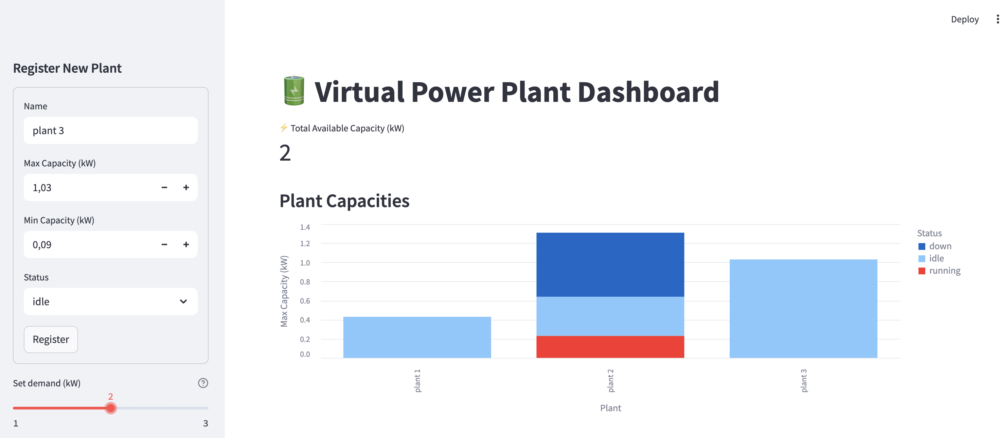
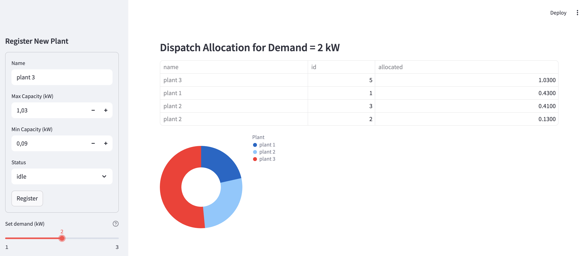

# 🔋 Virtual Power Plant (VPP)

## Overview

This project consists of two parts:

1. **FastAPI backend** (`src/vpp/`):  
   - Allows registering “plants” (e.g. battery or generator units),  
   - Aggregating available capacity,  
   - Dispatching power to meet a requested demand.

2. **Streamlit dashboard** (`app.py`):  
   - Visualizes the VPP’s capacity,  
   - Lets you add new plants via a sidebar form,  
   - Shows bar and pie charts of allocations.

---

## Architecture

```
vpp-python-clean/
├── app.py            # Streamlit dashboard
├── src/
│   └── vpp/
│       ├── main.py   # FastAPI app + endpoints
│       └── models.py # Pydantic data models
├── tests/
│   └── test_api.py   # pytest + httpx against FastAPI TestClient
├── requirements.txt  
├── .flake8           # Linting settings
├── Makefile          # Common tasks
└── .gitignore        
```

---

## Concept: Virtual Power Plant (VPP)

A **Virtual Power Plant (VPP)** aggregates a network of distributed energy resources (DERs)—batteries, solar arrays, diesel generators, etc.—into a single, flexible power plant that can be controlled and dispatched as one unit.  
Key functions in this project:

- **Register Plants** (`POST /plants/`):  
  Add a new DER with its minimum and maximum capacity, status, and a unique ID.

- **List Plants** (`GET /plants/`):  
  Retrieve all registered DERs and their current status (idle, running, or down).

- **Aggregate Capacity** (`GET /aggregate/`):  
  Calculate the sum of all available (non-down) generation/storage capacity.

- **Dispatch Request** (`POST /dispatch/`):  
  Distribute a demanded power amount across available DERs, returning:
  - **allocations**: how much each plant contributes,
  - **total_dispatched**: sum of allocations,
  - **unmet_demand**: any remaining demand beyond capacity.

---

## Makefile Commands

The provided `Makefile` simplifies all common tasks without manually activating the venv each time:

```makefile
SHELL := /bin/bash
export PATH := .venv/bin:$(PATH)

.PHONY: create-venv activate-venv activate-venv-win install lint lintfix start-backend start-backend-win start-frontend start-frontend-win init

create-venv:
    python3 -m venv .venv

activate-venv:
    . .venv/bin/activate

activate-venv-win:
    .\.venv\Scripts\Activate.ps1

install:
    python3 -m pip install --upgrade pip
    python3 -m pip install -r requirements.txt

lint:
    python3 -m flake8 src/ tests/ app.py

lintfix:
    python3 -m black .
    python3 -m isort .
    python3 -m autoflake --remove-all-unused-imports --remove-unused-variables --in-place -r .

start-backend:
    . .venv/bin/activate && uvicorn src.vpp.main:app --reload

start-backend-win:
    .\.venv\Scripts\Activate.ps1 ; uvicorn src.vpp.main:app --reload

start-frontend:
    . .venv/bin/activate && streamlit run app.py

start-frontend-win:
    .\.venv\Scripts\Activate.ps1 ; streamlit run app.py

init: create-venv install lint
```

### Usage Examples

```bash
make create-venv       # Create virtual environment
make install           # Install/upgrade dependencies
make lint              # Run linters
make lintfix           # Auto-format & sort imports
make start-backend     # Start API (http://127.0.0.1:8000)
make start-frontend    # Start UI (http://localhost:8501)
make init              # Setup + lint in one go
```

On **Windows (PowerShell)**:

```powershell
make create-venv
make activate-venv-win
make install
make start-backend-win
make start-frontend-win
```

---

## Manual Commands

If you prefer manual steps:

```bash
# macOS/Linux
python3 -m venv .venv
source .venv/bin/activate
python3 -m pip install --upgrade pip
python3 -m pip install -r requirements.txt
uvicorn src.vpp.main:app --reload
streamlit run app.py

# Windows (PowerShell)
python3 -m venv .venv
.\.venv\Scripts\Activate.ps1
python3 -m pip install --upgrade pip
python3 -m pip install -r requirements.txt
uvicorn src.vpp.main:app --reload
streamlit run app.py
```
# 🔋 Virtual Power Plant Dashboard

Below is a preview of our Streamlit UI after registering a couple of plants:




